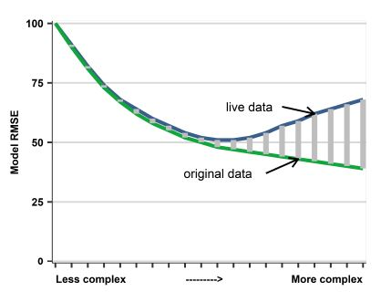

```{r setup, echo=FALSE}
knitr::opts_chunk$set(echo = TRUE)
knitr::opts_knit$set(root.dir = 'C:/Users/avalder/OneDrive - WU Wien/Documents/Study/WS_23_24/Pred_MLE_Econ/da_case_studies')
```

```{r,include=FALSE}
# Clear memory
rm(list=ls())
```

```{r, echo=FALSE, include=FALSE}
# Set directory, load functions and theme 
getwd()
#setwd("C:/Users/avalder/OneDrive - WU Wien/Documents/Study/WS_23_24/Pred_MLE_Econ/da_case_studies")
source("set-data-directory.R")
source("ch00-tech-prep/theme_bg.R")
source("ch00-tech-prep/da_helper_functions.R")
```
 
```{r, echo=FALSE, include=FALSE}
# Import libraries
library(tidyverse)
library(readr)
library(dplyr)
library(Metrics)
library(caret)
library(modelsummary)
library(fixest)
library(lmtest)
library(knitr)
```

**Task1:**
In order to construct 4 different models to predict earnings per hour, I first filter for the occupation `2310' which includes elementary and middle school teachers. Predictions for this occupation might help us when we have to decide what salary to put in a job advertisement for teachers, for example. Or if we want to investigate differences due to gender, education level, experience etc. The first step is to conduct the following data set preparation steps:
```{r, echo=FALSE, include=FALSE}
## load data
data_all <- read_csv(paste0(data_dir,"/cps-earnings/clean/morg-2014-emp.csv"),
                     col_types = cols(.default = "?", 
                                )) 
```

```{r,echo=FALSE, include=FALSE}
# 1) filter for occupation 
data <- data_all %>% filter(occ2012 == 2310)  #Elementary and middle school teachers
# first view of the data
summary(data)
glimpse (data)
```
**Sample design:**
In order to match the business or policy question,     I start by constructing the target variable earnings per hour from 'weekly earnings' and 'usual work hours. Next, I drop extreme values where earnings per hour is below 1 or larger than 300. Since I am interested in predicting "standard" teaching earnings per hour, earnings smaller than 1 would be considered errors. Keeping an extreme value, like '583' that is likely to be an error, would have a high-cost due to the quadratic errors in the loss function. In addition, I select an age range between 18 and 65, i.e.the working population age and an education level (= Highest grade attended) that includes only high school graduates or higher. The reasons for this is that for teachers under 18 teaching is likely not their main occupation. Moreover, including only teachers with a certain degree assures that we do not include for example tutoring from high school students in the sample. 

```{r,echo=FALSE,include=FALSE}
# 1) construct the target variable earnings per hour from 'weekly earnings' and 'usual work hours':

data <- data %>% mutate(earnh=earnwke/uhours)

                         
# 2) drop extreme values:

data %>% dplyr::select(earnh) %>% summary()
data <- data %>% filter(earnh >= 1 & earnh <= 300)

# 3) select age range of working population (18-65) 

data %>% dplyr::select(age) %>% summary()
#summary(as.factor(data$age))

data <- data %>% filter(age >= 18 & age <= 65)

# 4) Only consider teachers with a certain level of education 
# variable grade 92: Highest grade attended
#34 7th or 8th
#36 10th 
#37 11th
#38 12th grade NO DIPLOMA
#39 High school graduate, diploma or GED START 
#40 Some college but no degree 
#41 Associate degree -- occupational/vocational 
#42 Associate degree -- academic program 
#43 Bachelor's degree (e.g. BA,AB,BS) 
#44 Master's degree (e.g. MA,MS,MEng,Med,MSW,MBA) 
#45 Professional school deg. (e.g. MD,DDS,DVM,LLB,JD)
#46 Doctorate degree (e.g. PhD, EdD) 

summary(as.factor(data$grade92))
data <- data %>% filter(grade92 >= 38)

# all TRUE for occupation 
summary(as.factor(data$ind02)) 
```
**Label engineering:**
In this step I transformed the target variable into logs since it might be interesting to analyse relative changes rather than changes per monetary unit. Moreover, relative price differences are often more stable and the distribution of log prices is often close to normal, which makes linear regressions give better approximation to average differences.
As we can see from the histogram below, transforming the target variable to logs does not alter the shape of the distribution significantly. Therefore, I continue to use the target variable in levels.   
```{r,echo=FALSE, include=FALSE}
### label engineering: log vs label
#do:Look at some patterns & Compare model performance

data <- data %>% mutate(learnh=log(earnh))

# distribution of earnings per hour 

hist_earnh <- ggplot(data, aes(x=earnh))+
              geom_histogram(binwidth = 2, fill = color[1], color = color.outline, 
                             alpha = 0.8, size = 0.25) +
              ylab("Count") +
              xlab("Earnings per hour") +
              theme_bg()

# distribution of log earnings per hour 

hist_learnh <- ggplot(data, aes(x=learnh))+
              geom_histogram(binwidth = 0.1, fill = color[1], color =color.outline, alpha = 0.8, size = 0.25) +
              ylab("Count") +
              xlab("Earnings per hour (log)") +
              theme_bg()


```

**Feature engineering:** 
Next, I will define the list and functional form of variables that I later use as predictors. First, I look at missing values. Here I find that the two variables 'ethnic' and 'unioncov' contain missing values. Rather than imputing the data, I make use of related variables like 'race' and 'unionmme'. Second, after some visual inspections (boxplots like the ones below for 'sex' or 'prcitshp') I transform all relevant ordered categorical values or text variables to binary variables. I end up with 19 "new" binary variables: female, native, private, white, union, edu_HighS, edu_BA, edu_MA, edu_Prof, edu_PhD, married, divorced, wirowed, nevermar, child0, child1, child2, child3, child4plus.
Third, I look at the functional form of the predictors. Since I suspect a nonlinear relation between earnings per hour and age.  For example, the effect of age could be positive up until, the age of 50, and then negative thereafter. Therefore, I construct the variables 'agesq'. After inspecting the graphic relation, I also added 'lnage'. As indicated by the graphs the variable 'lnage' captures the relationship the best. For all other continuous predictors, I assume linear relationships.
Last, I consider interactions of variables. One is the interaction between 'female' and 'age' (and agesq, lnage). Age being here a proxy for years of experience. The interaction follows the believe, that the potential work experience for males and females is different, that is, females experience more career interruptions than males. Other interactions could have been occupation*state since industry and labour market structures that impact earnings per hour differ between regions. However, I am only considering one occupation here. To circumvent this another option is to include state fixed effects.
In the end the sample consists of 3623 observations and 49 variables (some redundant for the following analysis like household ID).Table 3 in the appendix presents a summary of all relevant variables.
```{r,echo=FALSE, include=FALSE}
#1. What to do with missing values? 

# where do we have missing variables in our data se?
to_filter <- sapply(data, function(x) sum(is.na(x)))
to_filter[to_filter > 0]

data$ethnic <- fct_explicit_na(as.character(data$ethnic),na_level = "Missing")
data$unioncov  <- fct_explicit_na(data$unioncov ,na_level = "Missing")

#ethnic, use race instead
#union cov, use unionmme instead - so no imputations necessary

```

```{r,echo=FALSE, include=FALSE}
#2. Dealing with ordered categorical values - continuous or set of binaries
#If binary (e.g, yes/no; male/female; 1/2) – create a 0/1 binary variable
#3. How to use text to create variables
#May simply go and find some words, and create binaries –> seminar


#2a) # female (1,0) create binary!  
summary(as.factor(data$sex))
data <- data %>% mutate(female=as.numeric(sex==2))

#  graph: earnings distribution male & female

boxplot_gender <- ggplot(data, aes(x = female, y = earnh)) +
  stat_boxplot(aes(group = female), geom = "errorbar", width = 0.3,
               color = c(color[2],color[1]), size = 0.5, na.rm=T)+
  geom_boxplot(aes(group = female),
               color = c(color[2],color[1]), fill = c(color[2],color[1]),
               size = 0.5, width = 0.6, alpha = 0.3, na.rm=T, outlier.shape = NA) +
  labs(x = "Sex (0 = male, 1 = female)",y = "Earnings per hour")+
    scale_y_continuous(limits =c(0,60), breaks = seq(0,60, 20)) +
  theme_bg()

boxplot_gender
```

```{r,echo=FALSE, include=FALSE}
#2b) Native & Foreign create binary!

summary(as.factor(data$prcitshp)) 

# graph: earnings distribution Citizenship status (boxplot)

boxplot_native <- ggplot(data, aes(x = prcitshp, y = earnh)) +
  stat_boxplot(aes(group = prcitshp), geom = "errorbar", width = 0.3,
               color = c(color[5],color[4],color[3],color[2],color[1]), size = 0.5, na.rm=T)+
  geom_boxplot(aes(group = prcitshp),
               color = c(color[5],color[4],color[3],color[2],color[1]), fill = c(color[5],color[4],color[3],color[2],color[1]),
               size = 0.5, width = 0.6, alpha = 0.3, na.rm=T, outlier.shape = NA) +
  labs(x = "Citizenship status",y = "Earnings per hour")+
    scale_y_continuous(limits =c(0,60), breaks = seq(0,60, 20)) +
  theme_bg()+
    scale_x_discrete(labels = label_wrap(10)) 

boxplot_native

# Native binary 

data <- data %>% mutate(native = ifelse(prcitshp=="Native, Born Abroad Of US Parent(s)",1,ifelse(prcitshp=="Native, Born in PR or US Outlying Area",1,ifelse(prcitshp=="Native, Born In US",1,0))))

summary(as.factor(data$native)) 

# graph: earnings distribution native & foreign (boxplot)

boxplot_native2 <- ggplot(data, aes(x = native, y = earnh)) +
  stat_boxplot(aes(group = native), geom = "errorbar", width = 0.3,
               color = c(color[2],color[1]), size = 0.5, na.rm=T)+
  geom_boxplot(aes(group = native),
               color = c(color[2],color[1]), fill = c(color[2],color[1]),
               size = 0.5, width = 0.6, alpha = 0.3, na.rm=T, outlier.shape = NA) +
  labs(x = "Citizenship status (0 = foreign, 1= native)",y = "Earnings per hour")+
    scale_y_continuous(limits =c(0,60), breaks = seq(0,60, 20)) +
  theme_bg()

boxplot_native2

data %>% dplyr::select(earnh,native) %>% filter(native==1) %>% summary()
data %>% dplyr::select(earnh,native) %>% filter(native==0) %>% summary()
```

```{r,echo=FALSE, include=FALSE}
#2c) # class of worker: private / gov. Create binary! 

summary(as.factor(data$class)) 


boxplot_class2 <- ggplot(data, aes(x = class, y = earnh)) +
  stat_boxplot(aes(group = class), geom = "errorbar", width = 0.3,
               color = c(color[5],color[4],color[3],color[2],color[1]), size = 0.5, na.rm=T)+
  geom_boxplot(aes(group = class),
               color = c(color[5],color[4],color[3],color[2],color[1]), fill = c(color[5],color[4],color[3],color[2],color[1]),
               size = 0.5, width = 0.6, alpha = 0.3, na.rm=T, outlier.shape = NA) +
  labs(x = "Class of worker",y = "Earnings per hour")+
    scale_y_continuous(limits =c(0,60), breaks = seq(0,60, 20)) +
  theme_bg()

boxplot_class2

# change to binary 

data <- data %>% mutate(private = ifelse(class == "Private, For Profit",1,ifelse(class == "Private, Nonprofit",1,0)))

summary(as.factor(data$private)) 

# graph: earnings distribution private & gov (boxplot)

boxplot_class <- ggplot(data, aes(x = private, y = earnh)) +
  stat_boxplot(aes(group = private), geom = "errorbar", width = 0.3,
               color = c(color[2],color[1]), size = 0.5, na.rm=T)+
  geom_boxplot(aes(group = private),
               color = c(color[2],color[1]), fill = c(color[2],color[1]),
               size = 0.5, width = 0.6, alpha = 0.3, na.rm=T, outlier.shape = NA) +
  labs(x = "Class of worker (0 = government, 1 = private)",y = "Earnings per hour")+
    scale_y_continuous(limits =c(0,60), breaks = seq(0,60, 20)) +
  theme_bg()

boxplot_class

```

```{r,echo=FALSE, include=FALSE}
#2) race binary as: white and other.

summary(as.factor(data$race)) 

data <- data %>% mutate(white = ifelse(race == 1 ,1,0))

summary(as.factor(data$white))

boxplot_race <- ggplot(data, aes(x = white, y = earnh)) +
  stat_boxplot(aes(group = white), geom = "errorbar", width = 0.3,
               color = c(color[2],color[1]), size = 0.5, na.rm=T)+
  geom_boxplot(aes(group = white),
               color = c(color[2],color[1]), fill = c(color[2],color[1]),
               size = 0.5, width = 0.6, alpha = 0.3, na.rm=T, outlier.shape = NA) +
  labs(x = "Race (White = 1, Else = 0)",y = "Earnings per hour") +
  scale_y_continuous(limits =c(0,60), breaks = seq(0,60, 20)) +
  theme_bg()

boxplot_race

```

```{r,echo=FALSE, include=FALSE}
# 2d) Education level. Create binaries.  

summary(as.factor(data$grade92)) 

#graph: earnings distribution education levels 

boxplot_grade92 <- ggplot(data, aes(x = grade92, y = earnh)) +
  stat_boxplot(aes(group = grade92), geom = "errorbar", width = 0.3,
               color = c(color[1],color[2],color[3],color[4],color[5],color[4],color[3],color[2],color[1]), size = 0.5, na.rm=T)+
  geom_boxplot(aes(group = grade92),
               color = c(color[1],color[2],color[3],color[4],color[5],color[4],color[3],color[2],color[1]), fill = c(color[1],color[2],color[3],color[4],color[5],color[4],color[3],color[2],color[1]),
               size = 0.5, width = 0.6, alpha = 0.3, na.rm=T, outlier.shape = NA) +
  labs(x = "Education level",y = "Earnings per hour")+
      scale_y_continuous(limits =c(0,60), breaks = seq(0,60, 20)) +
  scale_x_continuous(limits =c(37,47), breaks = seq(38,46, 1),label = c("12th grade NO DIPLOMA", "High school graduate, diploma or GED START", "Some college but no degree","Associate degree -- occupational/vocational","Associate degree -- academic", "Bachelor's degree", "Master's degree", "Professional school deg.", "Doctorate degree"))+
  theme_bg() +
  coord_flip()

boxplot_grade92

data  <- data %>% mutate(edu_HighS = as.numeric(grade92==38),
                        edu_BA = as.numeric(grade92==43),
                        edu_MA=as.numeric(grade92==44),
                        edu_Prof = as.numeric(grade92==45),
                        edu_PhD = as.numeric(grade92==46))

```

```{r,echo=FALSE, include=FALSE}
#2e) Unionmme or unioncov as 1, else 0  
summary(as.factor(data$unionmme))
summary(as.factor(data$unioncov))

data <- data %>% mutate(union = as.numeric(unionmme=="Yes" | unioncov=="Yes"))

boxplot_union <- ggplot(data, aes(x = union, y = earnh)) +
  stat_boxplot(aes(group = union), geom = "errorbar", width = 0.3,
               color = c(color[2],color[1]), size = 0.5, na.rm=T)+
  geom_boxplot(aes(group = union),
               color = c(color[2],color[1]), fill = c(color[2],color[1]),
               size = 0.5, width = 0.6, alpha = 0.3, na.rm=T, outlier.shape = NA) +
  labs(x = "Union (0 = No, 1 = Yes)",y = "Earnings per hour")+
      scale_y_continuous(limits =c(0,60), breaks = seq(0,60, 20)) +
  theme_bg()

boxplot_union

```

```{r,echo=FALSE, include=FALSE}
# Furhter demographics (family)
data <- data %>% mutate(married = as.numeric(marital==1 | marital==2),
                      divorced = as.numeric(marital==3 | marital==5 | marital==6),
                      wirowed = as.numeric(marital==4),
                      nevermar = as.numeric(marital==7),
                      child0 = as.numeric(chldpres==0),
                      child1 = as.numeric(chldpres==1),
                      child2 = as.numeric(chldpres==2),
                      child3 = as.numeric(chldpres==3),
                      child4plus = as.numeric(chldpres>=4))
# no need for "ownchild" variable  
```

```{r,echo=FALSE, include=FALSE}
# check frequency of teacher by state type
data %>%
  group_by(stfips) %>%
  dplyr::summarize(frequency=n()) %>%
  mutate(percent = frequency / sum(frequency)*100)
# most teacher is CA,, FL, NY, TX

# graph mean salary by state

salary_state <- ggplot(data, aes(reorder(stfips, earnh, FUN = mean), earnh)) +
  geom_bar(position='dodge', stat='summary', fun='mean',binwidth = 0.1, fill = color[1], color =color.outline, alpha = 0.8, size = 0.25) +
   coord_flip() +
  labs(x = "States",y = "Earnings per hour (mean)")+
  theme_bg()

salary_state

# use as fixed effects - state 

# Continuous variables – nothing to do. Make sure it is stored as number
#glimpse(data)
```

```{r,echo=FALSE, include=FALSE}
#4. Selecting functional form - log or sq of X's

# age squared:
#Adding the age squared to age, allows you to model the effect a differing ages, rather than assuming the effect is linear for all ages. Also added log after inspecting the graphic relation.

data <- data %>% mutate(agesq=age^2,
                        lnage = log(age))

plot_ageearnh <- ggplot(data = data, aes(x=data$age, y=earnh)) +
  geom_point( color = color[1], size = 1,  shape = 16, alpha = 0.8, show.legend=F, 
              na.rm = TRUE) + 
  geom_smooth(method="lm", se=F, colour=color[4], size=1, span=0.9) +
  labs(x = "Age (years)",y = "Earnings per hour") +
  theme_bg()

# squared age
plot_age2earnh <- ggplot(data = data, aes(x=agesq, y=earnh)) +
  geom_point( color = color[1], size = 1,  shape = 16, alpha = 0.8, show.legend=F, 
              na.rm = TRUE) + 
  geom_smooth(method="loess", se=F, colour=color[4], size=1, span=0.9) +
  labs(x = "Age (years) squared",y = "Earnings per hour") +
  theme_bg()


plot_agelearnh <- ggplot(data = data, aes(x=lnage, y=earnh)) +
  geom_point( color = color[1], size = 1,  shape = 16, alpha = 0.8, show.legend=F, 
              na.rm = TRUE) + 
  geom_smooth(method="loess", se=F, colour=color[4], size=1, span=0.9) +
  labs(x = "Age (years) in log",y = "Earnings per hour") +
  theme_bg()
```

```{r,echo=FALSE, include=FALSE}
#5. interactions: 
#Education Level and Years of Experience: (age)

data <- data %>% mutate(female_age =female*age,
                        female_agesq =female*agesq,
                        female_lnage = female*lnage)

#Other ideas:
# occupation*region – industry and labour market structures that impact on wages differ between regions (have only one occupation) 
#occupation*age and occupation*age squared – the return to work experience may be different for different  occupations (have only one occupation)

```

```{r,echo=FALSE, include=FALSE}
########## NOT NEEDED - CV done repeatedly within caret, traincontrol functions! 
### Split data randomly into test (20%) and train set (80%) (for CV RMSE later)

#data <- data %>% mutate(train_index = sample(c("train","test"),nrow(data),replace=TRUE,prob =c(0.8,0.2)))
#data_train <- data %>% filter(train_index == "train")
#data_test <- data %>% filter(train_index == "test")
```
**Models:**
As specified above, the target variable is earnings per hour. AI suggests including the following predictor variables when predicting teacher's earning per hour: education, year of experience, additional certifications, geographic location, school type, class size, employment status, gender and many more [ChatGPT](https://chat.openai.com/share/44e6cfb2-6a2a-4c1d-a824-1618ae741cd7). Unfortunately, not all of these variables are available in the data. I end up with the following four models:

* **Model 1:** edu_BA + edu_MA + edu_Prof + edu_PhD

* **Model 2:** edu_BA + edu_MA + edu_Prof + edu_PhD + age + lnage 

* **Model 3:** edu_BA + edu_MA + edu_Prof + edu_PhD + age + lnage + female + stfips 

* **Model 4:** edu_BA + edu_MA + edu_Prof + edu_PhD + age  + lnage + female + stfips + union+         native + private + white + married + divorced + wirowed + nevermar + child0+                child1 + child2 + child3 + child4plus + female_age + female_lnage 

In model 1 (the simplest) I try to explain earnings per hour by the "most obvious" factor education-, i.e. skill-level. I assume that the higher the education, the higher should be the earnings. In the second model, I add 'age' and 'lnage' as a proxy for experience. I assume that the older the teacher, the more experience she/ he has in teaching. Since the visualizations showed a nonlinear relation between age and earnings per hour, I also add the log of age. It seems that the gain of age (i.e. experience) is especially high in the beginning and then diminishes quickly. In the third model I include the variable 'female' since past research indicates disparities in earnings due to gender. Moreover, I add the
geographic location, since the labour market structures that impact earnings per hour might differ between regions. Furthermore. in model 4, I allow for more demographic variables I deem important for prediction: union membership, the origin of the teacher, their employment class and their race and some social variables concerning family status. On top, I add interaction terms as described above.
```{r,echo=FALSE, include=FALSE}
### The goal is to predict the earnings per hour that may be appropriate for teachers fulfilling certain criteria.

model_1 <- lm(earnh ~  edu_BA + edu_MA + edu_Prof + edu_PhD, data)
summary(model_1)

pred_1 <- predict(model_1, data)
resid_pred1 <- pred_1-data$earnh
summary(resid_pred1)
```

```{r,echo=FALSE, include=FALSE}
# model 2 - explain earnings per hour by education / skilllevel & experience (lnage)

model_2 <- lm(earnh  ~ edu_BA + edu_MA + edu_Prof + edu_PhD + age + lnage, data)

summary(model_2)

pred_2 <- predict(model_2, data)
resid_pred2 <- pred_2-data$earnh
summary(resid_pred2)

```

```{r,echo=FALSE, include=FALSE}
# model 3 - explain earnings per hour by education / skilllevel & experience (lnage) plus several other covariates like sex, family status, union ...
model_3 <- lm(earnh  ~  edu_BA + edu_MA + edu_Prof + edu_PhD + age  + lnage + female + stfips, data)

summary(model_3)

pred_3 <- predict(model_3, data)
resid_pred3 <- pred_3-data$earnh
summary(resid_pred3)
```

```{r,echo=FALSE, include=FALSE}
# model 4 - explain earnings per hour by education / skilllevel & experience (lnage) plus several other covariates like sex, family status, union ...including interaction terms (agesex)

model_4 <- lm(earnh  ~ age  + lnage + edu_BA + edu_MA + edu_Prof + edu_PhD + female + stfips +union + native + private + white + married + divorced + wirowed + nevermar + child0 + child1 + child2 + child3 + child4plus + female_age + female_lnage, data)
summary(model_4)

pred_4 <- predict(model_4, data)
resid_pred4 <- pred_4-data$earnh
summary(resid_pred4)
```

```{r,echo=FALSE, include=FALSE}
#model 5 Fixed effects
#model_5 <- feols(earnh ~ age  + lnage + edu_BA + edu_MA + edu_Prof + edu_PhD | stfips, data ,vcov = "HC1")
#summary(model_5)
```

```{r,echo=FALSE, include=FALSE}
### Cross validation 
set.seed(123)
# set number of folds
k <- 4

cv1 <- train(earnh ~  edu_BA + edu_MA + edu_Prof + edu_PhD, data, method = "lm", trControl = trainControl(method = "cv", number = k))

cv2 <- train(earnh  ~  edu_BA + edu_MA + edu_Prof + edu_PhD + age + lnage, data, method = "lm", trControl = trainControl(method = "cv", number = k))

cv3 <- train(earnh  ~  edu_BA + edu_MA + edu_Prof + edu_PhD + age  + lnage + female + stfips, data, method = "lm", trControl = trainControl(method = "cv", number = k), na.action = "na.omit")

cv4 <- train(earnh  ~  edu_BA + edu_MA + edu_Prof + edu_PhD + age + lnage + female + stfips +union + native + private + white + married + divorced + wirowed + nevermar + child0 + child1 + child2 + child3 + child4plus + female_age + female_lnage, data, method = "lm", trControl = trainControl(method = "cv", number = k), na.action = "na.omit")
```
**Task 2: Model Evaluation**
In order to analyse the performance of the four different models, I calculate the R-squared, the RMSE and the BIC in the full sample. In addition, I split my data into a test (20%) and train set (80%) and calculate the cross-validated RMSE.  
In Table 1 we can see that as the models become more complex (i.e. include more predictors) the R-squared increases, the RMSE of the full sample decreases until model 3 and then stays constant and the BIC first decreases and then increases again for model 3 and 4. This in line with the theory that the BIC penalizes adding additional predictors more heavily (Békés and Kézdi, 2021). Looking at table 2, we can see the cross validated RMSE, which is again the lowest for model 3 and 4. 

```{r,echo=FALSE, include=FALSE}
#Compare model performance of these models (a) RMSE in the full sample, (2) cross-validated RMSE and (c) BIC in the full sample.
models <- c("model_1", "model_2","model_3", "model_4")
BIC <- c()
RMSE <- c()
RSquared <- c()
regr <- c()
k <- c()
library(Metrics)
# Get for all models
for ( i in 1:length(models)){
  BIC[i] <- BIC(get(models[i]))
  RMSE[i] <- rmse(predict(get(models[i])), get(models[i])$model$earnh)
  RSquared[i] <-summary(get(models[i]))$r.squared
  regr[[i]] <- coeftest(get(models[i]), vcov = sandwich)
  k[i] <- get(models[i])$rank -1
}

evaluation <- data.frame(models, k, RSquared, RMSE, BIC)
colnames(evaluation)<-c("Models","N predictors", "R-squared", "RMSE (full)", "BIC")
evaluation
```

```{r,echo=FALSE}
#stargazer(evaluation, summary = F,digits=1,sep="",type="text")
kable(evaluation,digits=2,caption = "Earnings per hour - BIC, in-sampe RMSE")
```

```{r,echo=FALSE, include=FALSE}
# calculate average rmse
cv <- c("cv1", "cv2", "cv3", "cv4")
rmse_cv <- c()

for(i in 1:length(cv)){
  rmse_cv[i] <- sqrt((get(cv[i])$resample[[1]][1]^2 +
                       get(cv[i])$resample[[1]][2]^2 +
                       get(cv[i])$resample[[1]][3]^2 +
                       get(cv[i])$resample[[1]][4]^2)/4)
}
# summarize results
cv_mat <- data.frame(rbind(cv1$resample[4], "Average"),
           rbind(cv1$resample[1], rmse_cv[1]),
           rbind(cv2$resample[1], rmse_cv[2]),
           rbind(cv3$resample[1], rmse_cv[3]),
           rbind(cv4$resample[1], rmse_cv[4])
           )

colnames(cv_mat)<-c("Resample","Model1", "Model2", "Model3", "Model4")
cv_mat
```

```{r,echo=FALSE}
#stargazer(cv_mat, summary = F, digits=1, float=F, type="text")
kable(cv_mat, digits =2, caption = "Earnings per hour - CV RMSE")
```
**Task 3: Relationship between model complexity and performance:**
As can be seen from the results of the model evaluation above when the model complexity increases (due to additional features, interactions, polynomials etc.) the performance of the model at first increases but once a certain complexity is reached the model performance stagnates or decreases. The reason metrics like the BIC or the RMSE (full sample and cross validated) begin to raise again is overfitting. Overfitting means to fit a model to the data set that is too complex. It can happen for example that adding more and more features does not increase the predictive power because the "new" features are strongly correlated with predictor variables already in the model. Metrics like BIC and AIC penalize this compared to metrics like R-squared, which increases with the number of predictors. An option to avoid overfitting in the training data is to evaluate it on test data (cross validation) (Békés and Kézdi, 2021).The graph below visualizes the relationship between model complexity and performance. At first, the model RMSE decreases for both the live and original data when the complexity increases. After a certain threshold (i.e. overfitting) the RMSE of the live and the original data start to diverge with the RMSE of the original data falling monotonously and the RMSE for target observations rising. 

{ width=50% }
Source: Békés and Kézdi, (2021), p.379

## References
ChatGPT, Teacher Earnings Predictors, November 9, 2023.
Retrieved from: https://chat.openai.com/share/44e6cfb2-6a2a-4c1d-a824-1618ae741cd7

Békés,G., Kézdi,G.(2021).R, Python and Stata code for Data Analysis for Business, Economics, and Policy, ch13-used-cars-reg, GitHub repository, https://github.com/gabors-data-analysis/da_case_studies/tree/master/ch14-used-cars-log

Békés, G., & Kézdi, G. (2021). Data analysis for business, economics, and policy. Cambridge University Press, chapter 13.

## Appendix
```{r,echo=FALSE, include=TRUE}
# data summary
datasummary(earnh + learnh + age + agesq + lnage + female + female_age +female_agesq +female_lnage + native + private + white + union + married + divorced + wirowed + nevermar + child0 + child1 + child2 + child3 + child4plus  + edu_HighS +edu_BA + edu_MA + edu_Prof + edu_PhD    ~ Mean + Median + Min + Max + P25 + P75 + N , data = data, title = "Data summary" )
```

```{r, figures-side, fig.show="hold", out.width="50%", echo =FALSE}
par(mar = c(4, 4, .1, .1))
hist_earnh
hist_learnh
```

```{r, figures-side3, fig.show="hold", out.width="50%", echo =FALSE, message=FALSE, warning=FALSE}
par(mar = c(4, 4, .1, .1))
plot_age2earnh
plot_agelearnh
```

```{r, figures-side2, fig.show="hold", out.width="50%", echo =FALSE}
par(mar = c(4, 4, .1, .1))
boxplot_gender
boxplot_native
```